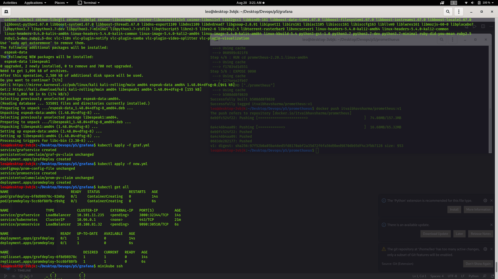

# Devops5

Integrate Prometheus and Grafana and perform in following way:
1.  Deploy them as pods on top of Kubernetes by creating resources Deployment, ReplicaSet, Pods or Services
2.  And make their data to be remain persistent 
3.  And both of them should be exposed to outside world
    

**Job1**
Here We need to create two images
Grafana
Prometheus 
Using the Docker files we make the images docker files are renamed here for no conflicts and easily understandable

**Creating image for grafna**

**Creating image for prometheus**

**Using grafana.yml(graf.yml) && prometheus.yml(new.yml)**
kubectl apply -f grapf.yml
kubectl apply -f new.yml

minikube ip
to know ip

***Graphana Server Running 

Prometheus server Running

All files are provided on repo needs renaming
